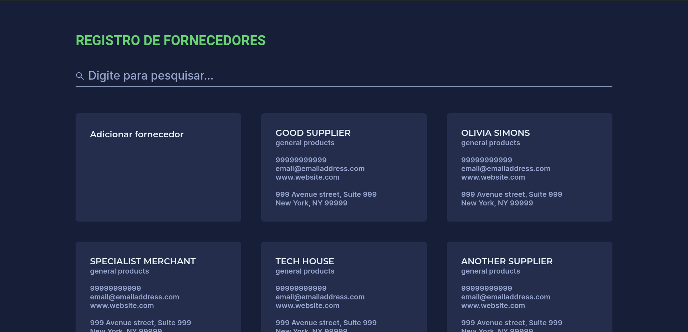
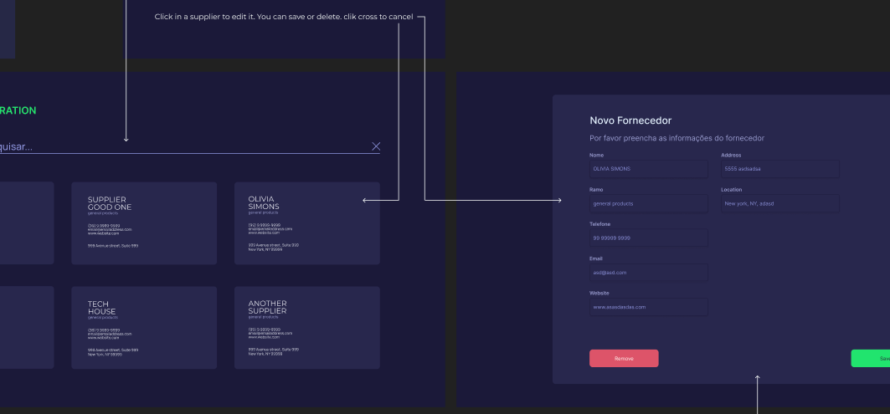

<h2 align="center"> REGISTRO DE FORNECEDORES </h1>

 Módulo de cadastro de fornecedores  

<h3 align="center" style="font-size:12px" ><a href="https://suppliersregistration.netlify.app/" >Clique aqui ou na imagem para visitar o projeto</a></h3>

## Layout

Você pode visualizar o layout que fiz para projeto através [DESSE LINK](https://www.figma.com/community/file/1380387393770247099), ou clique na imagem. É necessário ter conta no [FIGMA](https://www.figma.com/) para editá-lo.

## Projeto

Desafio Desenvolvedor Front-End proposto pela [INSIGHT DATA SCIENCE LAB](https://www.insightlab.ufc.br/)

Um Módulo de cadastro de fornecedores

● Cadastrar fornecedor;

● Listar fornecedores cadastrados;

● Editar, visualizar e excluir fornecedores cadastrados.

---

Feito por <a href="https://github.com/jairo-sousa/" >Jairo Sousa</a>
